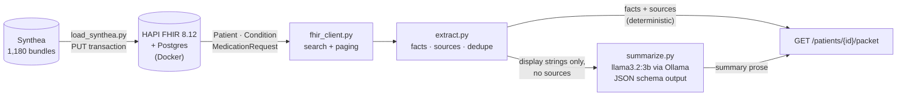

# fhir-clinical-summarize

Assembles a source-cited clinical packet from a FHIR server, summarized by a local LLM.

Before a prior-authorization request can be reviewed, someone has to pull the patient's
history together out of scattered records. This service does that assembly: it reads a
patient's conditions and medications from a FHIR server, turns them into facts that each
carry the id of the record they came from, and asks a local 3B model to write two sentences
a reviewer can scan.

**Every fact is traceable.** A reviewer can take any `source` in the response and read the
original record:

```
"display": "Hypertension",  "source": "Condition/4821"
                                       └─> GET /fhir/Condition/4821
```

**This service assembles evidence. It never issues an authorization decision.**

---

## Data flow



The split in the middle is the point of the design. Facts, statuses, dates and source
references are settled by deterministic Python before the model is called, and the model's
output is only ever assigned to `summary`. The model never sees a resource id, so it cannot
fabricate a citation, and an LLM failure costs the prose rather than the evidence.

---

## Quickstart

Requires Docker (or Colima), Python 3.11+, and [Ollama](https://ollama.com).

```bash
# 1. FHIR server
docker compose up -d
until curl -sf http://localhost:8080/fhir/metadata >/dev/null; do sleep 5; done

# 2. Local model
ollama pull llama3.2:3b

# 3. Python environment
python -m venv .venv && ./.venv/bin/pip install -e ".[dev]"

# 4. Synthetic data (1.3 GB, gitignored -- not in this repo)
mkdir -p data && cd data
curl -LO https://synthetichealth.github.io/synthea-sample-data/downloads/synthea_sample_data_fhir_r4_sep2019.zip
unzip -q synthea_sample_data_fhir_r4_sep2019.zip && cd ..

# 5. Load a reproducible sample of patients
./.venv/bin/python -m scripts.load_synthea -n 300

# 6. Run the service
./.venv/bin/uvicorn app.main:app --reload
```

Then open **http://localhost:8000/ui/** for the dashboard, or
**http://localhost:8000/docs** for the API.

```bash
# find a patient
curl -s "localhost:8000/patients?family=Runte676" | jq .

# build their packet
curl -s "localhost:8000/patients/632b7c1c-9545-4aa7-9fd5-07683139ef13/packet" | jq .

# verify a citation by hand -- what a reviewer would do
curl -s "localhost:8080/fhir/Condition/ce034b73-37e8-489c-bd6f-9c52a08ff605" | jq .
```

---

## API

| Endpoint | |
|---|---|
| `GET /health` | liveness |
| `GET /patients` | search by **any** FHIR `Patient` search parameter |
| `GET /patients/{id}` | one patient summary |
| `GET /patients/{id}/packet` | **the deliverable** — facts, sources, summary, missing |
| `GET /ui/` | React dashboard |
| `GET /docs` | OpenAPI |

### Search is validated against the server, not a hardcoded list

`GET /patients` forwards any subset of parameters after checking them against the FHIR
server's own `CapabilityStatement`, so all 34 parameters this HAPI instance supports work,
and an unknown one fails with the valid list rather than confusing the server downstream:

```bash
curl "localhost:8000/patients?address-city=Boston"              # 24 matches
curl "localhost:8000/patients?gender=female&birthdate=ge1980-01-01"
curl -G localhost:8000/patients \
  --data-urlencode "identifier=http://hospital.smarthealthit.org|792be1e3-..."   # by MRN
```

```jsonc
// GET /patients?lastname=Smith  ->  400
{
  "detail": {
    "message": "unsupported search parameter(s): lastname",
    "supported": ["_id", "active", "address", "address-city", "birthdate", "family",
                  "gender", "given", "identifier", "name", "organization", ...]
  }
}
```

### Example packet

```json
{
  "patient_id": "3f8be6b0-15a6-43f4-87f3-1adb737fa598",
  "conditions": [
    { "display": "Viral sinusitis (disorder)",
      "source": "Condition/04a5822d-8a5c-4f0c-a900-035574d639cb",
      "status": "resolved", "date": "2018-02-11" }
  ],
  "medications": [
    { "display": "Acetaminophen / Dextromethorphan / doxylamine Oral Solution",
      "source": "MedicationRequest/7371bd7b-0b35-42a1-8b1d-30a3565a5189",
      "status": "stopped", "date": "2012-08-14" }
  ],
  "summary": "The patient has a history of viral sinusitis and acute bronchitis, but currently has no active conditions. The patient has previously taken acetaminophen for symptom relief...",
  "missing": ["No active conditions on file", "No active medications on file"]
}
```

---

## Technical decisions

### Resource ids are client-assigned (`PUT`, not `POST`)

Synthea ships each bundle with every entry set to `POST`, which lets the server pick ids.
`scripts/load_bundle.py` rewrites them to `PUT <Type>/<id>` using the id already on each
resource. Three consequences:

- **Citations survive a reload.** With server-assigned ids, re-loading the data renumbers
  everything and every previously emitted `source` points at the wrong record. A citation
  that breaks when the database is rebuilt is a weak citation.
- **Loading is idempotent.** First run returns `201 Created` for every entry, a second run
  returns `200 OK` and the patient count does not change.
- **Shared resources deduplicate for free.** Synthea derives `Organization` ids
  deterministically, so the same hospital `PUT`s to the same id across bundles. 301 patients
  produced **370 organizations** rather than one per bundle.

`fullUrl` is deliberately left untouched — the `urn:uuid:` values are how entries reference
each other inside the transaction, and the server resolves references against them.

One constraint: HAPI rejects purely numeric client-assigned ids (`HAPI-0960`), reserving
them for itself. Synthea's UUIDs are unaffected.

### Two deduplication rules, because repetition means two different things

| | Key | Why |
|---|---|---|
| Medications | `(display, status)` | Repetition is repeat dosing — one `MedicationRequest` per chemo cycle |
| Conditions | `(display, status, date)` | Repetition is separate episodes |

The condition rule exists because of a specific patient: Adolph has **viral sinusitis in
2014 and again in 2018**. Those are two illnesses, and a `(display, status)` key silently
deletes one of them from the record. The surviving fact keeps the newest record's source and
a `count` of how many collapsed, so 60 cisplatin cycles stay visible as `count: 60` rather
than being thrown away.

Packets are serialized with `exclude_defaults`, so a `Fact` carries only the fields that say
something: `display` and `source` always, `status` and `date` when present, and `count` only
when records were actually collapsed. `Packet`'s own fields have no defaults, so an empty
`medications` list and an empty `summary` survive — "no medications on file" and "the model
returned nothing" are both findings, not absences.

### Prompt shaping — measured, not guessed

The busiest loaded patient has 14 conditions and **164 medication orders** (which are 11
distinct drugs: 60 cisplatin, 60 paclitaxel, 36 simvastatin).

| Payload sent to the model | ~Tokens |
|---|---|
| Raw FHIR from the two searches | **45,000** |
| One `Fact` per resource | 5,000 |
| After deduplication | 774 |
| Split into active / past | **460** |

Deduplication is not an optimization here, it is a correctness requirement: **Ollama's
default `num_ctx` is 4096 and it truncates silently** rather than erroring, so the
undeduplicated payload would have produced a confident summary of partial data.
`num_ctx` is set explicitly to 8192.

**Active and past are split in Python, not left to the model.** Given a flat list with
`status` fields, llama3.2:3b returns a comma-separated dump — `"Stroke (active),
Osteoporosis (active), ..."`. Given pre-grouped lists and an explicit "do not output a
list", it writes prose. Grouping is trivial in Python and unreliable in a 3B model.

**Active facts carry their onset date** (`"Obesity (since 1997-08-26)"`). One patient has a
condition still flagged `active` with a **1990** onset — a Synthea artifact, but a model
given only the status writes it up as a present-day problem.

### `missing` is computed in code

Asked to report an absence, a small model will sometimes report a presence. The deterministic
layer emits `"No medications on file"` / `"No active conditions on file"`.

### Failure modes degrade rather than propagate

- `summarize.write_summary()` **never raises.** Timeout, malformed JSON, or schema violation
  all return `""`, and the packet ships with facts and sources intact.
- A missing patient is a `404`; an unreachable or broken FHIR server is a `502`. Those are
  different failures and a caller needs to tell them apart.
- `_summary=count` requests send `Cache-Control: no-cache` and `_total=accurate`, because
  HAPI caches search results and returns stale counts immediately after a write.

### Infrastructure

- **HAPI image pinned** to `hapiproject/hapi:v8.12.0-2` so the demo cannot change underneath
  it. The image is distroless (no shell, no curl), so readiness is polled from outside via
  `GET /fhir/metadata` rather than with a container healthcheck. Both it and `postgres:14`
  publish native `arm64`, so there is no emulation on Apple silicon.
- **Postgres rather than the default H2**, so the loaded dataset survives a restart.
- **The dashboard is served by FastAPI itself** at `/ui`, same-origin with the API. That
  avoids CORS entirely, and avoids the mixed-content block a hosted `https://` page would hit
  calling a local `http://` backend. React and Babel load from a CDN, so there is no build
  step and no `node_modules` in the repo.

---

## Model choice

**`llama3.2:3b`** (Meta, 2 GB, Q4_K_M) served by Ollama, using
[structured outputs](https://ollama.com/blog/structured-outputs) — a JSON schema in the
`format` field — so the reply is always parseable rather than prose to be scraped.
`temperature: 0` so the same packet summarizes identically twice, which matters for both the
hand review and for demoing under questioning.

Reasons it fits the job:

- The task after shaping is **writing, not reasoning**. The hard decisions — what is active,
  what deduplicates, what is missing — are made in Python. A 3B model is being asked to turn
  four short lists into two sentences.
- **~460 prompt tokens** means the smallest capable model is the right one; nothing here
  benefits from a larger context or deeper reasoning.
- 2 GB fits comfortably alongside HAPI and Postgres on an 8 GB laptop, with no GPU and no
  paid API.

> **TODO before the panel:** benchmark against `gemma3:4b` and `phi4-mini:3.8b` over the same
> 10 patients and record latency, JSON validity rate, and hallucination count. `ollama_model`
> is already a setting, so this costs one environment variable:
> `OLLAMA_MODEL=gemma3:4b ./.venv/bin/uvicorn app.main:app`

---

## Results and observations

### Measured on this machine (Apple M2, 8 GB, Colima 4 CPU / 8 GB)

| | |
|---|---|
| Dataset | 1,180 bundles, 1.34 GB JSON, ~629,000 FHIR resources |
| Loaded | **301 patients** → 2,185 conditions, 2,356 medication requests, 53,785 observations |
| Postgres size | **832 MB** for 301 patients (~2.8 MB/patient → ~3.3 GB for all 1,180) |
| Load throughput | ~2.1 s per bundle → the full 1,180 would take roughly 40 minutes |
| Packet latency | **3–8 s** warm, ~19 s on the first call while the model loads |
| Tests | 20, all deterministic (no FHIR server, no model) |

A representative sample was loaded rather than all 1,180: the hand review covers 10
patients, the endpoint serves one at a time, and clinical variety saturates well before 300.
`scripts/load_synthea.py -n 1180` runs the full set if wanted. The sample is drawn with a
fixed seed over a sorted file list, so the same `-n` and `--seed` reproduce the same cohort
on any machine — otherwise the review numbers below would mean nothing.

### Findings from the data

- **Status is the main correctness risk.** Three of the first patients inspected had
  *everything* resolved or stopped. A summary that reports "patient has bronchitis and
  sinusitis" for someone whose infections cleared in 2012 is wrong in the way that matters.
  This drove `status` into the prompt, the active/past split, and the `missing` entries.
- **`clinicalStatus: active` does not mean clinically current.** One patient carries an
  `active` "Miscarriage in first trimester" with a 1990 onset. FHIR's `active` means the
  problem-list entry is open, not that the event is ongoing. Dates are in the prompt for
  this reason; weighting by recency is left as future work rather than decided silently.
- **Repetition is extreme.** 164 medication orders → 11 distinct drugs. Any system reading
  this data naively will blow its context window on duplicates.
- **`MedicationRequest.reasonReference` links a prescription to the condition it was written
  for.** For prior authorization that linkage *is* the decision — the reviewer's question is
  rarely "does the patient take this drug" but "is there a documented indication." Not yet
  surfaced in the packet; see below.
- **A malformed bundle in the working copy was skipped cleanly** by the loader rather than
  ending the run. Partial-failure handling is not speculative defensiveness here.

### Hand review of 10 patients

> **TODO — not yet done.** `scripts/eval_sample.py` is still a stub. The review should report,
> for each of 10 patients: (1) is the summary fair — no invented conditions, no approve/deny
> language, correct about what is active; (2) do the sources resolve to a real record that
> matches the `display`. Report as counts, e.g. "10/10 sources resolved; 9/10 summaries fair",
> plus the failure modes observed.
>
> Three patients already identified as worth including, each covering a different edge:
> - `3f8be6b0-...` — everything resolved/stopped (tests the status handling)
> - `632b7c1c-...` — two active conditions, **zero** medications (tests `missing`)
> - `5e4b559d-...` — 14 conditions, 164 medication orders (tests deduplication)

One reproducible prose issue already observed: on the busiest patient the summary opens
*"has a history of stroke, non-small cell carcinoma … with current active conditions
including stroke"* — framing the same conditions as both history and current. The facts it
named were all genuinely in `active_medications` (checked against the prompt payload), so it
is a clarity problem rather than a hallucination, but it is the kind of thing only hand
review catches.

---

## What I would do next, and why

Ranked by value to a reviewer.

1. **Surface `reasonReference` — drug-to-indication linkage.** Emit
   `"Metformin 500 MG" → indication: "Diabetes" (Condition/4821)`. This answers the actual
   prior-authorization question instead of leaving the reviewer to infer it, it is entirely
   deterministic, and the data is already in the record. Highest value per hour of work.
2. **Finish the 10-patient evaluation**, then replace it with something repeatable: assert
   that every `display` in a summary appears in the facts given to the model. That turns
   hallucination from something you notice into something CI catches.
3. **Add `AllergyIntolerance`.** 40 of them in the sample, and a documented allergy is often
   the whole reason an alternative drug was requested. One more search, same `Fact` shape.
4. **Benchmark the three other candidate models** and put the numbers in this file.
5. **Recency weighting.** A condition with a 1990 onset should not read like a current
   problem. This is a clinical judgment call, which is why it is listed rather than
   implemented — it belongs in a conversation with the customer, not in a silent heuristic.
6. **Persist the packet.** A `packet_request` table storing `{patient_id, requested_by,
   requested_at, model, prompt_version, packet JSONB}`. In prior authorization you must be
   able to reconstruct what the reviewer saw six months ago, and re-running the endpoint
   cannot do that: the record has changed, and possibly the model and prompt too. HAPI
   preserves *record* history for free; it has no idea what this service rendered.
7. **Field-level citation.** `source` points at a resource; pointing at the exact element
   (`Condition/4821#code.coding[0]`) would let a UI highlight the precise evidence.
8. **Operational hardening** for a real deployment: auth, multi-tenancy, retries with
   backoff on the FHIR client, structured request logging.

Deliberately **not** done: caching packets (a cached clinical packet can show a reviewer a
medication list that has since changed — if ever added, it needs a short TTL and a visible
`as_of` timestamp), and `Observation` (53,785 of them, ~60% of all resources, and they would
swamp both the packet and the model's context for marginal gain).

---

## Code provenance

The assignment asks where the code came from. Honestly:

**Machine-generated.** Effectively all of the Python, the shell script, and the React page
were written by **Claude (Claude Code, Opus)** in an interactive session, under my direction
— I specified the goals, chose between the options it presented, and reviewed the output.
That includes `app/extract.py`, `app/summarize.py`, `app/fhir_client.py`, `app/main.py`,
`app/models.py`, `scripts/load_bundle.py`, `scripts/load_synthea.py`,
`scripts/show_conditions.sh`, `tests/test_extract.py`, `ui/index.html`, and this README.

**Human-authored.** `docker-compose.yml`, `pyproject.toml`, `app/config.py` and the original
module scaffolding predate that session.

**Design decisions driven by measurement, not by the model's defaults.** Nearly every choice
documented above came from probing the running system — the token counts, the 164-to-11
deduplication, Ollama's silent 4096-token truncation, HAPI's numeric-id rejection, HAPI's
search-result caching, the `arm64` manifests, the two-sinusitis-episodes dedupe key. Those
were found by querying this stack, not recalled from documentation.

**Third-party sources consulted** (no code copied verbatim):
[HAPI FHIR JPA starter](https://github.com/hapifhir/hapi-fhir-jpaserver-starter) ·
[HAPI JPA schema docs](https://hapifhir.io/hapi-fhir/docs/server_jpa/schema.html) ·
[FHIR R4 spec](https://hl7.org/fhir/R4/) (`http.html`, `search.html`, `condition.html`,
`medicationrequest.html`) ·
[Ollama API](https://github.com/ollama/ollama/blob/main/docs/api.md) and
[structured outputs](https://ollama.com/blog/structured-outputs) ·
[Synthea sample data](https://synthetichealth.github.io/synthea-sample-data/)

**Dependencies:** FastAPI, Pydantic, pydantic-settings, HTTPX, uvicorn, pytest, ruff.
React 18 and Babel are loaded from cdnjs at runtime.

---

## Project layout

```
app/
  config.py        settings, env-overridable (FHIR_BASE_URL, OLLAMA_MODEL, ...)
  models.py        Fact, Packet, PatientSummary, PatientPage -- the response contract
  fhir_client.py   HTTP to HAPI: reads, searches, paging, capability lookup
  extract.py       FHIR -> facts + sources + dedupe + missing + prompt shaping (no LLM)
  summarize.py     Ollama structured output; never raises
  main.py          FastAPI routes
scripts/
  load_bundle.py   load one bundle, PUT semantics, narrated step by step
  load_synthea.py  load a reproducible random sample of N bundles
  eval_sample.py   10-patient hand review  [STUB]
  show_conditions.sh   spot-check one patient's conditions and sources from the CLI
tests/
  test_extract.py  20 tests over the deterministic layer
ui/index.html      single-file React dashboard
docker-compose.yml HAPI FHIR 8.12 + Postgres 14
```

The service is **stateless** — it owns no database. HAPI's Postgres is the source of truth,
reached over the FHIR API, which is both how a real deployment would work (you do not get to
copy a hospital's clinical data into a side table) and what keeps `source` meaningful.
`models.py` is a response contract, not a storage schema.

```bash
./.venv/bin/pytest tests/ -q        # 20 tests, no server or model needed
./.venv/bin/ruff check app/ tests/ scripts/
```

---

## Scope notes

The assignment asks for one endpoint. The patient search endpoints and the React dashboard
are beyond that ask — they exist because a demo needs a way to find a patient before building
their packet. The packet endpoint and the hand review are the deliverable; the dashboard is
not a substitute for either.

Synthea data is entirely synthetic. No real patient data is involved anywhere in this
project. (Incidentally, "HAPI" is HL7's Java API — unrelated to HIPAA.)
